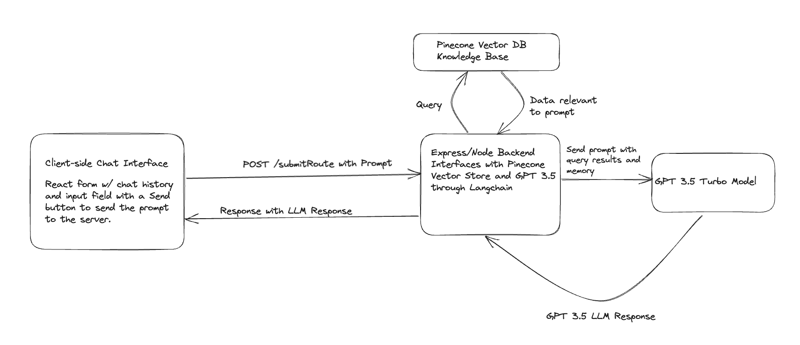

# GPTMail
GPTMail is a prototype application that allows users to upload email data in PDF or JSON format to a Pinecone vector store index and use it as a knowledge base when querying ChatGPT 3.5 about their email data.

## Problem Statement
The crux of the problem posed is the challenge of providing a ChatGPT-like large language model (LLM) with a custom knowledge base. In our case, this custom knowledge base will be a user's email inbox. As a proof of concept, this email inbox has been implemented through PDF files in the `server/emails` directory.

## Getting Started
To get started with GPTMail, you will need to set up the following environment variables in a file named config.env in the `server` directory:

```
OPENAI_API_KEY="your_openai_api_key"
PINECONE_ENVIRONMENT="your_pinecone_environment"
PINECONE_API_KEY="your_pinecone_api_key"
PINECONE_INDEX="your_pinecone_index"
```

Furthermore, you will need to install the dependencies for the client and server. To do so, run the following commands:

```
npm install
cd server
npm install
```

Add emails you want to add to your Pinecone index, which is the chatbot's knowledge base, to the `server/emails` directory. These emails should be in PDF format. You can also add emails in JSON format to the `server/emails` directory. Note that any encoded strings will have to be decoded. 

Finally, you can run the client with the following command in the root directory:

```
npm start
```

To run the server, `cd` into the `server` directory in a separate shell and run the following command:

```
npm start
```

Navigate to `http://localhost:3000` to access the client and interact with the application.

## API Routes
**POST /submitPrompt**

This route allows users to submit a prompt to the GPT-3 API.

**Request Body**

The request body should be a JSON object with the following fields:

prompt: The prompt to submit to the GPT-3.5 model.

**Response**

The `POST /submitPrompt` has three possible responses:

* `200`: This status code indicates a successful call to the OpenAI ChatGPT API and that a response was received. The response data will contain the text result based on the given prompt.

* `400`: This status code indicates that the prompt was not provided. This happens usually in the case of user error or an error with the prompt not being received by the server. This is an extra safeguard on top of the input on the client side being disabled if trimming the input results in an empty string.

* `500`: This status code indicates that an error occurred on the server while processing the request or with Pinecone or OpenAI. In this case, the error message will be included in the response body.

## Design Diagram


### Client Design
The client is built using React and TypeScript with the `mui` package used for styled components. It is a form with a message input box and a Send button. The Send button is disabled if the message input box is empty or if the message input box is empty after trimming the input. The `ChatInterface` component also shows the chatbot's responses. A `Message` interfact with the following fields is used to represent a message: `text` and `isUser`. The `text` field is the text of the message, while the `isUser` field is a boolean indicating whether the message was sent by the user or the chatbot.

### Server Design
The server is built using Node.js and Express. It provides a single route, `submitPrompt`, that accepts POST requests with a prompt in the request body. The server then sends the prompt to the OpenAI ChatGPT 3.5 model and returns the response to the client.

The server uses the `langchain` and `pinecone-client` npm packages to interact with the OpenAI and Pinecone APIs, respectively. The `langchain` package is used to send prompts to the ChatGPT 3.5 model, while the `pinecone-client` package is used to index and query email data in Pinecone using OpenAI's embeddings, creating a vector index with 1536 dimensions using cosine similarity.

## [Demo](https://www.youtube.com/watch?v=JV7teiAoDyM)

## Beyond GPTMail.init()
Some potential next steps for this application include, but are not limited to:

1. **Email API integration.** The extra tech debt and work involved with integrating email APIs such as Gmail and Outlook were ruled to be beyond the scope of this initial prototype. This included things like decoding base64 strings which are returned from the Gmail API instead of the raw text in the email body. Furthermore, getting messages from the Gmail API in a high volume can lead to possible rate limitations. This is because the API requires one `GET` request to get a list of message and thread ids. One then must iterate through these ids and send separate `GET` requests for each singular message.

2. **Chat history.** This would be incorporated through a No-SQL database such as MongoDB given these chats will undertake more write operations than read operations. The `Message` interface also allows for a simple document structure. These can then be loaded into the `ChatInterface` component. An additional collection can be created to store the `memory` object connected to the chat history. This way, the chat model will be able to remember the context of the conversation.

3. **Chrome extension.** This could be an elegant way to extend GPTMail's usability. Currently, it requires a separate page to be loaded in order to use the application. A Chrome extension would allow users to use GPTMail alongside their existing web email client without having to click away from their email inbox.
